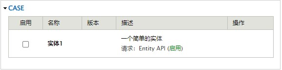
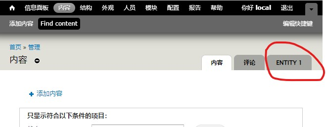
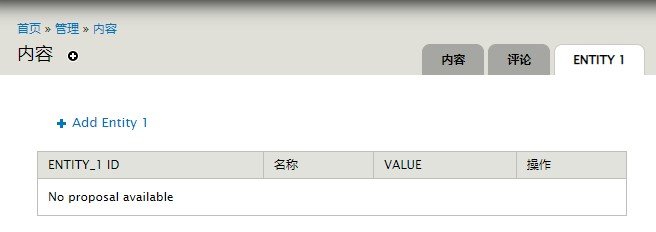
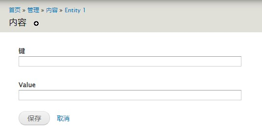

# 一个简单的实体
先从一个简单的案例来了解一下实体是什么？


## 新建一个模块
模块目录位于：`site/all/module/case/entity_1`，并包含以下三个文件:
- `entity_1.info`
- `entity_1.install`
- `entity_1.module`


## 定义模块信息
在 `entity_1.info` 文件增加以下内容：
```info
name = 实体1
description = 一个简单的实体
core = 7.x
php = 5.6
package = case

dependencies[] = entity
```



## 创建数据表
在 `entity_1.install` 文件增加以下内容：
```php
<?php

function entity_1_schema() {
    $schema = array(
        'entity_1' => array(
            'fields' => array(
                'id' => array(
                    'type' => 'serial', // 自增
                    'unsigned' => TRUE,
                    'not null' => TRUE,
                ),
                'key' => array(
                    'type' => 'varchar',
                    'length' => 255,
                    'not null' => TRUE,
                    'default' => '',
                ),
                'value' => array(
                    'type' => 'varchar',
                    'length' => 255,
                    'not null' => TRUE,
                    'default' => '',
                ),
            ),
            'primary key' => array('id'), // 表主键
            'unique keys' => array(       // 表唯一键
                'uk_key' => array('key')
            ),
        )
    );
    return $schema;
}
```


## 实现 `{hook}_entity_info` 钩子
在 `entity_1.module` 文件增加以下内容：
```php
<?php

/**
 * Implement {hook}_entity_info
 */
function entity_1_entity_info() {
    return array(
        'entity_1' => array(
            'label' => t('Entity 1'),                     // 标题
            'base table' => 'entity_1',                   // 实体依赖的数据表
            'entity class' => 'Entity',                   // 实体对象类
            'controller class' => 'EntityAPIController',  // 实体数据库操作类
            'entity keys' => array(
                'id' => 'id'                              // 数据表主键。必须是数字值
            )
        )
    );
}
```


## 实现 `{hook}_menu` 钩子
现在实体已经定义完毕，需要一个界面可以完成对实体的操作。

在 `entity_1.module` 文件增加以下内容：
```php
function entity_1_menu() {
    $items['admin/content/entity_1'] = array(
        'title'            => 'Entity 1',
        'page callback'    => 'drupal_get_form',
        'page arguments'   => array('entity_1_list_form'),
        'description'      => 'Manage Entity 1.',
        'access callback'  => TRUE,
        'type'             => MENU_LOCAL_TASK,
    );
    $items['admin/content/entity_1/add'] = array(
        'title'            => 'Add Entity 1',
        'page callback'    => 'drupal_get_form',
        'page arguments'   => array('entity_1_edit_form'),
        'access callback'  => TRUE,
        'type'             => MENU_LOCAL_ACTION,
    );
    $items['admin/content/entity_1/%/edit'] = array(
        'title'            => 'Edit Entity 1',
        'page callback'    => 'drupal_get_form',
        'page arguments'   => array('entity_1_edit_form', 3),
        'access callback'  => TRUE,
    );
    $items['admin/content/entity_1/%/delete'] = array(
        'title'            => 'Delete Entity 1',
        'page callback'    => 'entity_1_delete',
        'page arguments'   => array(3),
        'access callback'  => TRUE,
        'type'             => MENU_CALLBACK,
    );
    return $items;
}
```



## 实现 `entity_1_list_form` 和 `entity_1_edit_form` 页面函数
在 `entity_1.module` 文件增加以下内容：
```php
function entity_1_list_form($form, &$form_state) {
    $header = array(
        'id'        => array('data' => t('Entity_1 ID')),
        'name'      => array('data' => t('Name')),
        'value'     => array('data' => t('Value')),
        'operation' => array('data' => t('Operation'))
    );

    $rows = array();
    $result = db_select('entity_1', 'e')->fields('e')->range(0, 10)->execute();
    foreach ($result as $r) {
        $row = array(
            'data' => array(
                'id'        => array('data' => $r->id),
                'key'       => array('data' => $r->key),
                'value'     => array('data' => $r->value),
                'operation' => array(
                    'data' => array(
                        '#theme' => 'links__group_operation_links',
                        '#links' => array(
                            'edit' => array(
                                'title' => t('Edit'),
                                'href' => "admin/content/entity_1/{$r->id}/edit",
                            ),
                            'delete' => array(
                                'title' => t('Delete'),
                                'href' => "admin/content/entity_1/{$r->id}/delete",
                            )
                        ),
                        '#attributes' => array('class' => array('links', 'inline')),
                    )
                )
            )
        );
        $rows[] = $row;
    }

    $form['output'] = array(
        '#theme'  => 'table',
        '#header' => $header,
        '#rows'   => $rows,
        '#empty'  => t('No proposal available'),
    );
    return $form;
}

function entity_1_edit_form($form, &$form_state, $entity_1_id = NULL) {
    $entity_1 = NULL;
    if ($entity_1_id) {
        $entitys = entity_load('entity_1', array($entity_1_id));
        $entity_1 = reset($entitys);
    }

    // $form_state 是引用的，我们可以将获取到的实体保存起来，供后续操作使用
    $form_state['entity_1'] = $entity_1;

    $form['key'] = array(
        '#title'         => t('Key'),
        '#type'          => 'textfield',
        '#required'      => TRUE,
        '#default_value' => $entity_1 ? $entity_1->key : '',
    );
    $form['value'] = array(
        '#title'         => t('Value'),
        '#type'          => 'textfield',
        '#required'      => TRUE,
        '#default_value' => $entity_1 ? $entity_1->value : '',
    );
    $form['actions'] = array('#type' => 'actions');
    $form['actions']['submit'] = array(
        '#type' => 'submit',
        '#value' => t('Save'),
        '#submit' => array('entity_1_edit_form_submit')
    );
    $form['actions']['cancel'] = array(
        '#markup' => l(t('Cancel'), 'admin/content/entity_1'),
    );

    return $form;
}
```

- `entity_1_list_form` 函数显示一个表格页面

    

- `entity_1_edit_form` 函数显示一个表单页面

    


## 实现 `entity_1_edit_form_submit` 方法，针对实体的新增和编辑
在 `entity_1.module` 文件增加以下内容：
```php
function entity_1_edit_form_submit($form, &$form_state) {
    $entity_1 = &$form_state['entity_1'];
    if (!$entity_1) {
        // 当 $form_state 内的 entity_1 为空，一律表示新增
        $entity_1 = entity_create('entity_1', array(
            'key'   => $form_state['values']['key'],
            'value' => $form_state['values']['value'],
        ));
    } else {
        $entity_1->key   = $form_state['values']['key'];
        $entity_1->value = $form_state['values']['value'];
    }

    // 保存实体
    $entity_1->save();

    // 设置跳转页面
    $form_state['redirect'] = 'admin/content/entity_1';
}
```


## 实现 `entity_1_delete` 方法，针对实体的删除
在 `entity_1.module` 文件增加以下内容：
```php
function entity_1_delete($entity_1_id) {
    $entitys = entity_load('entity_1', array($entity_1_id));
    if (!empty($entitys)) {
        $entity_1 = reset($entitys);
        $entity_1->delete();
    }

    drupal_goto('admin/content/entity_1');
}
```


## 总结
以上一个简单的实体就完成了。

从上面的案例可以发现，`实体` 实际上就是对一个 `数据集` 的操作进行抽象化。


## 遇到的问题
- 提示 `entity_1_entity_info` 函数已定义。

  出现该问题的原因是开启了 `Entity Token` 模块，在 `entity/entity_token.module` 文件内定义了一个空的 `entity_1_entity_info` 方法。

  解决方案：
  1. 卸载 `Entity Token` 模块。
  2. 注释/删除 `Entity Token` 模块的 `entity_1_entity_info` 方法。