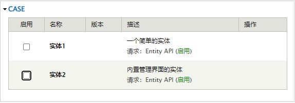
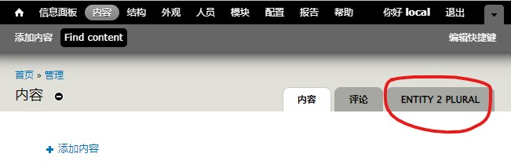

# 内置管理界面的实体
在[《一个简单的实体》](/v7/module/entity/1.md)案例中，实体的界面是我们自己手动写的。其实 `Entity API` 已经内置了一个实体管理界面，让我们去使用吧~


## 新建一个模块
模块目录位于：`site/all/module/case/entity_2`，并包含以下三个文件:
- `entity_2.info`
- `entity_2.install`
- `entity_2.module`


## 定义模块信息
在 `entity_2.info` 文件增加以下内容：
```info
name = 实体2
description = 内置管理界面的实体
core = 7.x
php = 5.6
package = case

dependencies[] = entity
```



## 创建数据表
在 `entity_2.install` 文件增加以下内容：
```php
<?php

function entity_2_schema() {
    $schema = array(
        'entity_2' => array(
            'fields' => array(
                'id' => array(
                    'type' => 'serial',
                    'unsigned' => TRUE,
                    'not null' => TRUE,
                ),
                'key' => array(
                    'type' => 'varchar',
                    'length' => 255,
                    'not null' => TRUE,
                    'default' => '',
                ),
                'value' => array(
                    'type' => 'varchar',
                    'length' => 255,
                    'not null' => TRUE,
                    'default' => '',
                ),
            ),
            'primary key' => array('id'),
            'unique keys' => array(
                'uk_key' => array('key')
            ),
        )
    );

    return $schema;
}
```


## 实现 `{hook}_entity_info` 钩子
在 `entity_1.module` 文件增加以下内容：
```php
<?php

/**
 * Implement {hook}_entity_info
 */
function entity_1_entity_info() {
    return array(
        'entity_2' => array(
            'label' => t('Entity 2'),
            'plural label' => t('Entity 2 Plural'),
            'description' => t('Entity 2 Description'),
            'base table' => 'entity_2',
            'entity class' => 'Entity',
            'controller class' => 'EntityAPIController',
            'entity keys' => array(
                'id' => 'id'
            ),
            'admin ui' => array(
                // 管理界面路径，内部实际上还是使用 {hook}_menu 定义路径
                'path' => 'admin/content/entity_2',
                // 路由占位符。如果定义了该项，则必须自己实现 entity_2_load 方法。默认：entity_object
                // 'menu wildcard' => '%entity_2',
                // 实体管理界面处理类
                'controller class' => 'EntityDefaultUIController',
            ),
            // 定义页面的访问权限验证函数
            'access callback' => 'entity_2_access'
        )
    );
}
```


虽然使用了默认的UI管理界面，但有部分操作还是需要自己实现：
- 增加访问认证函数，否则无权访问页面
    ```php
    /**
     * 实体的访问权限验证
     * @param {string} $op          操作类型。如：view、add、edit 等
     * @param {string} $entity      实体对象
     * @param {string} $account     要检查的用户
     * @param {string} $entity_type 实体类型。如：entity_2
     *
     * @see entity/entity.module    entity_access
     */
    function entity_2_access($op, $entity, $account, $entity_type) {
        return TRUE;
    }
    ```

- 通过 `{hook}_menu_alter` 钩子，修改管理界面入口的显示。
    ```php
    /**
     * Implement {hook}_menu_alter
     */
    function entity_2_menu_alter(&$items) {
        if (isset($items['admin/content/entity_2'])) {
            // 主要将入口明确的显示在“右上角”
            $items['admin/content/entity_2']['type'] = MENU_LOCAL_TASK;
        }
    }
    ```
    

    ::: tip 为什么要修改？
    因为定义的路径是挂在 `admin/content` 下的，若不定义菜单的显示类型，就会看不到入口。

    当然，如果入口是 `entity_2` 这种形式，默认会显示在首页的导航菜单里。

    注：没有访问权限也看不到该入口。
    :::


## 实现 `entity_2_form` 表单界面
